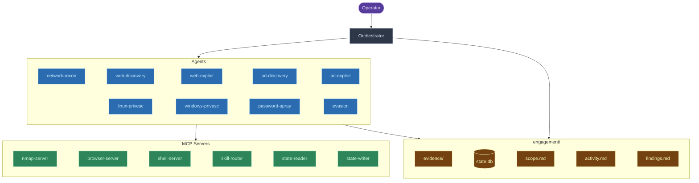
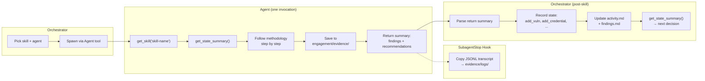

# red-run Architecture & Workflow

Visual reference for how red-run components connect and how engagements flow.

## Architecture Overview

How the orchestrator, agents, MCP servers, and state fit together.

**Agent → MCP access:**

| Agent | MCP Servers |
|-------|-------------|
| orchestrator | skill-router, state-reader, state-writer |
| network-recon | skill-router, nmap-server, shell-server, state-reader |
| web-discovery | skill-router, shell-server, browser-server, state-reader |
| web-exploit | skill-router, shell-server, browser-server, state-reader |
| ad-discovery, ad-exploit | skill-router, shell-server, state-reader |
| linux-privesc, windows-privesc | skill-router, shell-server, state-reader |
| password-spray | skill-router, shell-server, state-reader |
| evasion | skill-router, shell-server, state-reader |

## Engagement Workflow

The orchestrator's decision loop from target to objective.

```mermaid
flowchart TD
    Start(["User: #quot;attack TARGET#quot;"]) --> Scope

    %% ── Step 1: Setup ──
    subgraph S1["Scope & Setup"]
        Scope[Gather scope, creds,<br>rules of engagement]
        Scope --> Init[mkdir engagement/<br>init_engagement]
        Init --> WriteScope[Write scope.md<br>activity.md · findings.md]
    end

    %% ── Step 2: Recon ──
    WriteScope --> ScanQ

    subgraph S2["Reconnaissance"]
        ScanQ{HARD STOP<br>Scan type?}
        ScanQ -->|quick / full / custom| NR[network-recon-agent<br>→ network-recon]
        ScanQ -->|import XML| Parse[Parse XML<br>record to state]

        NR --> RecordRecon[Record hosts, ports,<br>services to state]
        Parse --> RecordRecon

        RecordRecon --> HostCheck{New hostnames<br>resolve?}
        HostCheck -->|no| HostsFix["HARD STOP<br>Write hosts-update.sh<br>Wait for operator"]
        HostsFix -->|operator confirms| HostCheck
        HostCheck -->|yes| WebPorts{HTTP/HTTPS<br>ports found?}

        WebPorts -->|yes| WD[web-discovery-agent<br>→ web-discovery]
        WebPorts -->|no| Surface

        WD --> VhostCheck{Vhosts<br>resolve?}
        VhostCheck -->|no| HostsFix
        VhostCheck -->|yes| Surface
    end

    %% ── Step 3: Attack Surface ──
    Surface[Categorize attack surface<br>Web · AD · SMB · DB<br>Containers · Remote Access]

    subgraph S3["Mode Selection"]
        ModeCheck{Mode?}
        ModeCheck -->|guided| Present[Present surface<br>+ chain analysis<br>Operator picks path]
        ModeCheck -->|autonomous| AutoPick[Prioritize:<br>Web → AD → DB → Other]
    end

    Surface --> ModeCheck

    %% ── Step 4: Discovery & Exploitation ──
    Present --> SkillPick
    AutoPick --> SkillPick

    subgraph S4["Discovery & Exploitation"]
        SkillPick[Pick skill + agent<br>from routing table]
        SkillPick --> Spawn[Spawn agent<br>with skill + context]
        Spawn --> AgentRun

        subgraph AgentBox["Agent invocation"]
            AgentRun[Load skill → execute<br>→ save evidence<br>→ return findings]
        end
    end

    %% ── Post-skill processing ──
    AgentRun --> PostSkill

    subgraph Post["Post-Skill Checkpoint"]
        PostSkill[Parse return summary]
        PostSkill --> RecordState["Record to state:<br>add_target · add_credential<br>add_vuln · add_access<br>add_pivot · add_blocked"]
        RecordState --> LogActivity[Append activity.md<br>+ findings.md]
        LogActivity --> UserCheck{New usernames<br>discovered?}
        UserCheck -->|yes| SprayStop
        UserCheck -->|no| ChainAnalysis
    end

    %% ── Usernames hard stop ──
    subgraph Spray["Credential Attack Gate"]
        SprayStop["HARD STOP<br>Show usernames<br>+ lockout policy"]
        SprayStop --> SprayQ{Spray<br>intensity?}
        SprayQ -->|skip| ChainAnalysis
        SprayQ -->|light / medium / heavy| PW[password-spray-agent<br>→ password-spraying]
        PW --> RecordCreds[Record valid creds<br>to state]
        RecordCreds --> ChainAnalysis
    end

    %% ── Step 5: Chaining ──
    subgraph S5["Chaining"]
        ChainAnalysis["get_state_summary()<br>Analyze pivot map"]
        ChainAnalysis --> D1{Unexploited<br>vulns?}
        D1 -->|yes| SkillPick
        D1 -->|no| D2{Shell access<br>without root?}
        D2 -->|yes| DiscoverHost
        D2 -->|no| D3{Untested<br>creds?}
        D3 -->|yes| TestCreds[Test creds against<br>all services]
        TestCreds --> SkillPick
        D3 -->|no| D4{Uncracked<br>hashes?}
        D4 -->|yes| Crack["credential-cracking<br>(inline)"]
        Crack --> ChainAnalysis
        D4 -->|no| D5{Pivot paths<br>available?}
        D5 -->|yes| SkillPick
        D5 -->|no| D6{Objectives<br>met?}
    end

    %% ── Host discovery routing ──
    subgraph HostDisc["Shell → Host Discovery"]
        DiscoverHost{OS?}
        DiscoverHost -->|Linux| LinDisc[linux-privesc-agent<br>→ linux-discovery]
        DiscoverHost -->|Windows DC| ADEnum[ad-discovery-agent<br>→ ad-discovery]
        DiscoverHost -->|Windows non-DC| WinDisc[windows-privesc-agent<br>→ windows-discovery]
        LinDisc & ADEnum & WinDisc --> PostSkill
    end

    %% ── Recovery paths ──
    AgentRun -->|"AV blocked"| AVRecover
    AgentRun -->|"clock skew"| ClockRecover

    subgraph Recovery["Recovery Paths"]
        AVRecover[evasion-agent<br>→ av-edr-evasion]
        AVRecover -->|"bypass payload"| Spawn
        AVRecover -->|"no bypass"| RecordBlocked[add_blocked<br>move to next vector]
        RecordBlocked --> ChainAnalysis

        ClockRecover["Write clock-sync.sh<br>Wait for operator"]
        ClockRecover -->|"synced"| Spawn
    end

    %% ── Completion ──
    D6 -->|yes| PostExploit
    D6 -->|no| Stuck[No more paths<br>Report current state]

    subgraph S6["Post-Exploitation"]
        PostExploit[Collect evidence<br>Update state<br>Verify objectives]
    end

    PostExploit --> Done
    Stuck --> Done

    Done([Engagement Complete])
    Done -.-> Retro[retrospective<br>→ skill improvements]

    %% Styling
    classDef hardstop fill:#9b2c2c,stroke:#fed7d7,color:#fed7d7
    classDef agent fill:#2b6cb0,stroke:#bee3f8,color:#bee3f8
    classDef decision fill:#6b46c1,stroke:#e9d8fd,color:#e9d8fd
    classDef process fill:#2d3748,stroke:#e2e8f0,color:#e2e8f0
    classDef endpoint fill:#2f855a,stroke:#c6f6d5,color:#c6f6d5

    class ScanQ,SprayStop,HostsFix hardstop
    class NR,WD,PW,LinDisc,ADEnum,WinDisc,AVRecover,AgentRun agent
    class HostCheck,WebPorts,VhostCheck,ModeCheck,UserCheck,SprayQ,D1,D2,D3,D4,D5,D6,DiscoverHost decision
    class Start,Done,Retro endpoint
```

## Skill Invocation Lifecycle

What happens inside a single agent invocation.

