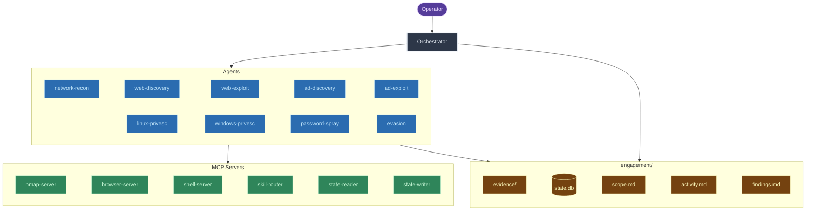

# red-run

Offensive security toolkit for Claude Code.

red-run combines skills, MCP servers, and agents with routing logic that guides Claude through the phases of an infrastructure-focused attack — recon, initial access, lateral movement, privilege escalation, and post-exploitation. It tracks engagement state in a SQLite database that persists across context compactions, routes to skills via semantic search (RAG), and delegates execution to focused agents that each handle one technique per invocation.

In **guided mode** (default), the orchestrator presents the attack surface, chain analysis, and available paths — you choose what to hit next. In **autonomous mode**, it routes automatically and keeps going until objectives are met or all paths are exhausted.

## Features

- **Offensive security skills** - baseline SKILL.md files for web, AD, privesc, network, evasion, cracking
- **Semantic skill routing** - ChromaDB + sentence-transformer embeddings
- **Persistent shell sessions** - reverse shells and interactive tools maintain state across agent invocations
- **Headless browser automation** - Playwright accessible to agents via MCP
- **Engagement state tracking** - SQLite DB storing targets, credentials, access, vulns, pivot paths, and blocked techniques
- **Retrospectives** - post-engagement analysis that identifies skill gaps and routing mistakes

## How it works

The `orchestrator` skill runs on Opus with extended thinking in the main conversation thread. It spawns domain-specific agents that each load one skill, execute the methodology, save evidence, and report back. The orchestrator parses findings, updates state, and routes to the next skill.



See [ARCHITECTURE.md](ARCHITECTURE.md) for engagement workflow and skill lifecycle diagrams.

## Skills

67 skills across 7 categories — see [SKILLS.md](SKILLS.md) for the full inventory.

| Category | Count | Coverage |
|----------|-------|----------|
| Web | 33 | SQLi, XSS, SSTI, deserialization, SSRF, auth bypass, and more |
| Active Directory | 16 | Kerberos, ADCS, ACLs, GPO, trust, persistence, lateral movement |
| Privilege Escalation | 11 | Linux + Windows enumeration and technique skills |
| Infrastructure | 4 | Network recon, pivoting, container escapes, SMB |
| Evasion | 1 | AV/EDR bypass, AMSI bypass, custom payloads |
| Utility | 2 | Orchestrator + retrospective |

Skills are baseline templates researched and built by Claude. Refine them manually or run retrospectives after engagements to improve and hone them to your target landscape and methodology.

## Installation

**Prerequisites:** Linux VM with pentesting tools, [Claude Code](https://docs.anthropic.com/en/docs/claude-code), [uv](https://docs.astral.sh/uv/), [Docker](https://docs.docker.com/engine/install/)

```bash
./install.sh          # Symlink-based (edits reflect immediately)
./install.sh --copy   # Copy-based (standalone machines)
./uninstall.sh        # Remove everything
```

The installer sets up the orchestrator, agents, and MCP servers, and indexes `skills/` into ChromaDB for semantic retrieval. The repo must stay in place — skill-router reads from `skills/` at runtime.

## Configuration

Run from a VM or dedicated pentesting machine. Claude Code's bwrap sandbox blocks network socket creation, so add a sandbox exception to `~/.claude/CLAUDE.md`:

```markdown
## Sandbox

Always use `dangerouslyDisableSandbox: true` for commands that make network
connections: nmap, ping, netexec, curl, wget, sqlmap, impacket-*, certipy,
bloodyAD, ffuf, nuclei, httpx, responder, tcpdump, ssh, smbclient, ldapsearch,
crackmapexec, gobuster, hydra, chisel, ligolo, socat, nc, python3 -m http.server.

For everything else (file reads, writes, local processing, hash cracking),
keep sandbox enabled.
```

Recommended: [Trail of Bits Claude Code configuration](https://github.com/trailofbits/claude-code-config) for additional guardrails.

## Warning

Autonomous mode pairs with `claude --dangerously-skip-permissions` (yolo mode). **We do not recommend this.** Claude will chain skills, pop shells, move laterally, and escalate privileges **on its own**. Use guided mode and avoid `--dangerously-skip-permissions` for maximum safety. You are responsible for containing Claude on your systems and for any legal consequences under the CFAA or equivalent legislation.

## Disclaimer

For use in **authorized security testing and educational contexts only**. Do not use against systems without explicit written permission. Skills are baseline templates — expect gaps and techniques that need validation against real targets. While skills include OPSEC notes where relevant, do not trust red-run to maintain OPSEC in production environments without dedicated review and testing.
