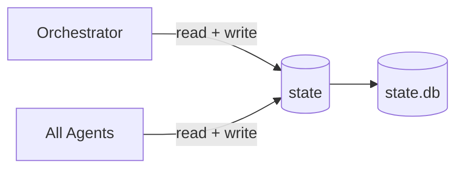

# Agents

red-run delegates skill execution to **domain-specific subagents**. Each agent loads exactly one skill per invocation, executes its methodology, saves evidence, and returns findings to the orchestrator.

## Agent Model

The orchestrator never executes technique skills directly. Instead, it spawns a specialized agent via Claude Code's Agent tool:

1. **Orchestrator picks** the skill and matching agent from the routing table
2. **Agent loads** the skill via `get_skill()` from the skill-router MCP
3. **Agent reads** current engagement state via `get_state_summary()`
4. **Agent executes** the skill methodology step by step
5. **Agent saves** raw evidence to `engagement/evidence/`
6. **Agent returns** a structured summary of findings
7. **Orchestrator parses** the summary and records state changes

Each agent invocation is stateless — agents don't persist between skills. The orchestrator passes context (injection points, working payloads, target technology, and operator-selected web proxy listeners when applicable) in the task prompt.

```mermaid
flowchart LR
    subgraph Orchestrator
        Pick[Pick skill + agent] --> Spawn[Spawn via Agent tool]
    end

    subgraph Agent["Agent (one invocation)"]
        Load["get_skill('skill-name')"] --> ReadState["get_state_summary()"]
        ReadState --> Execute[Follow methodology<br>step by step]
        Execute --> SaveEvidence[Save to<br>engagement/evidence/]
        SaveEvidence --> Report[Return summary:<br>findings + recommendations]
    end

    Spawn --> Load
    Report --> Parse[Parse return summary]

    subgraph Post["Post-Skill Processing"]
        Parse --> Record["Record state changes"]
        Record --> Next["Next routing decision"]
    end
```

## Routing Table

The orchestrator uses this table to match skills to agents. Each agent has access to specific MCP servers based on its domain.

| Agent | Domain | MCP Servers | Skills |
|-------|--------|-------------|--------|
| `network-recon-agent` | Network | skill-router, nmap-server, shell-server, **state** | network-recon, smb-exploitation, pivoting-tunneling |
| `web-discovery-agent` | Web discovery | skill-router, shell-server, browser-server, **state** | web-discovery |
| `web-exploit-agent` | Web exploitation | skill-router, shell-server, browser-server, **state** | All web technique skills (32) |
| `ad-discovery-agent` | AD discovery | skill-router, shell-server, **state** | ad-discovery |
| `ad-exploit-agent` | AD exploitation | skill-router, shell-server, **state** | All AD technique skills (15) |
| `linux-privesc-agent` | Linux privesc | skill-router, shell-server, **state** | linux-discovery + 4 technique skills, container-escapes |
| `windows-privesc-agent` | Windows privesc | skill-router, shell-server, **state** | windows-discovery + 5 technique skills |
| `password-spray-agent` | Credential spraying | skill-router, shell-server, **state** | password-spraying |
| `evasion-agent` | AV/EDR evasion | skill-router, shell-server, **state** | av-edr-evasion |
| `credential-cracking-agent` | Credential cracking | skill-router, **state** | credential-cracking |

> **Note:** All agents use the **state** MCP server with full read/write access. This ensures critical discoveries (captured hashes, confirmed vulns, new pivot paths) reach the orchestrator immediately via event watcher.

## Discovery vs Technique Agents

Agents fall into two categories with different responsibilities, but all share the same state access level (full read/write via state).

### Discovery Agents

Discovery agents **enumerate attack surface** and identify vulnerabilities. They return findings and recommended next skills to the orchestrator — they never invoke technique skills themselves.

**Discovery agents:** `network-recon-agent`, `web-discovery-agent`, `ad-discovery-agent`, `linux-privesc-agent`, `windows-privesc-agent`

### Technique Agents

Technique agents **exploit specific vulnerabilities**. All findings are reported in their return summary — the orchestrator parses the summary and writes state changes.

**Technique agents:** `web-exploit-agent`, `ad-exploit-agent`, `password-spray-agent`, `evasion-agent`, `credential-cracking-agent`

### Shared State Access

All agents use the **state** MCP server with full read/write access. Each write emits a `state_events` row for real-time monitoring. Deduplication is handled at the database level.

Agents write discoveries directly to state so the orchestrator can act on them immediately via the event watcher — without waiting for the agent to finish. This is especially important for technique agents that capture hashes or credentials during exploitation.

## Model Selection

Most agents run on the default model (Sonnet or Opus, depending on configuration). Three agents use **Haiku** for cost efficiency because their work is more mechanical:

| Agent | Model | Rationale |
|-------|-------|-----------|
| `network-recon-agent` | Haiku | Structured nmap parsing and service enumeration |
| `password-spray-agent` | Haiku | Batch credential testing with simple pass/fail logic |
| `credential-cracking-agent` | Haiku | Local-only hashcat/john operations, no target interaction |

All other agents use the default model, which handles complex exploitation reasoning, multi-step attack chains, and creative problem-solving.

## State Access Pattern

All agents and the orchestrator share a single state MCP server with full read/write access to the same SQLite database. WAL mode and `busy_timeout=5000` handle concurrent access safely. Deduplication is handled at the database level.

When any agent finds credentials, captures hashes, or confirms a vulnerability mid-run, it writes them directly so the orchestrator can act via the event watcher without waiting for agent completion.

## Tool Execution: Bash vs Shell-Server

Each agent must choose between the Bash tool and the shell-server MCP for command execution. The rule is simple: **Bash is the default**, shell-server is for specific use cases.

**Use Bash for:**

- Single non-interactive commands (`nmap`, `curl`, `hashcat`, `certipy`)
- File operations, text processing, tool installation
- Anything that runs and exits

**Use shell-server `start_process()` for:**

- Interactive shells that need persistent state (`evil-winrm`, `ssh`, `msfconsole`)
- Privileged Docker execution (`privileged=True`) for tools in the red-run-shell container
- Daemons needing raw sockets (`Responder`, `mitm6`, `tcpdump`)

**Use shell-server `start_listener()` / `send_command()` for:**

- Catching reverse shells
- Sending commands to established shell sessions
- Interacting with stabilized PTY sessions

## Return Summary Format

When an agent finishes, its return summary must include structured findings for the orchestrator to parse:

- **New targets/hosts** — with ports and services
- **New credentials** — usernames, secrets, types
- **Access gained** — user, privilege level, method
- **Vulnerabilities confirmed** — with status and severity
- **Pivot paths** — what leads where
- **Blocked items** — what failed, why, and whether it's retryable

The orchestrator uses this summary to update engagement state and make the next routing decision.

## Inline Fallback

If custom agents aren't installed (e.g., `install.sh` wasn't run), the orchestrator falls back to loading skills inline via `get_skill()` in the main conversation thread. This works but has tradeoffs:

- No parallel agent execution
- All skill output stays in the main context window
- MCP access depends on what's configured for the main session

The inline fallback is useful for quick tests or environments where agent installation isn't practical.

## Scope Boundaries and Stall Detection

Each agent operates within strict scope boundaries defined by its loaded skill:

- **Scope boundary**: When a skill says "Route to **skill-name**", the agent stops and returns to the orchestrator with findings and the recommended next skill. Agents never load or execute another skill.
- **Stay in methodology**: Agents only use techniques documented in their loaded skill. No improvisation, no custom exploit code, no techniques from other domains.
- **Stall detection**: If an agent spends 5+ tool-calling rounds on the same failure with no meaningful progress, it stops and returns with what was attempted, what failed, and whether it's permanently blocked or retryable.
- **AV/EDR detection**: If a payload is caught by antivirus, the agent stops immediately and returns structured context for the orchestrator to pass to the evasion agent.
- **DNS failures**: If hostname resolution fails, the agent stops and returns the failing hostname so the orchestrator can request operator intervention.

Agent source files live in `agents/` (version controlled) and are installed to `~/.claude/agents/` by `install.sh`.
