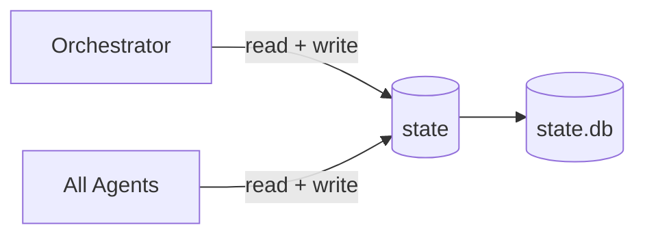

# Engagement State

red-run tracks all engagement data in a SQLite database at `engagement/state.db`. This database persists across context compactions, so targets, credentials, vulnerabilities, and access records survive long multi-hour engagements where conversation history is trimmed.

The orchestrator is the sole owner of engagement state. It creates the database, writes all records, and uses the state to make routing decisions — which skill to run next, which credentials to spray, which vulnerabilities to chain.

## Engagement directory

```
engagement/
├── scope.md          # Target scope, credentials, rules of engagement
├── state.db          # SQLite engagement state
├── dump-state.sh     # Export state.db as markdown (from operator/templates/)
└── evidence/         # Saved output, responses, dumps
    └── logs/         # Subagent JSONL transcripts
```

The orchestrator creates this directory at the start of an engagement. Skills degrade gracefully when it doesn't exist — they just skip logging.

### dump-state.sh

The orchestrator copies `operator/templates/dump-state.sh` into the engagement directory at init time. Run it to view or back up state as markdown:

```bash
cd engagement && bash dump-state.sh
bash dump-state.sh --db /path/to/state.db > snapshot.md
```

Produces the same sections as `get_state_summary()` but without truncation limits, plus a Timeline section showing all `state_events` rows.

## Schema

The database has 10 tables:

| Table | Purpose | Key Fields |
|-------|---------|------------|
| `engagement` | Singleton — engagement metadata | name, status, timestamps |
| `targets` | Host IPs and hostnames | host, os, role |
| `ports` | Per-target open ports (1:many from targets) | port, protocol, service, banner |
| `credentials` | Username/secret pairs | username, secret, secret_type, domain |
| `credential_access` | Where each credential has been tested | credential_id, target_id, service, works |
| `access` | Active footholds and sessions | ip, access_type, username, privilege, via_credential_id, via_access_id, via_vuln_id |
| `vulns` | Confirmed vulnerabilities | title, host, vuln_type, severity, status |
| `pivot_map` | Directed edges — what leads where | source, destination, method, status |
| `blocked` | Failed techniques with reasons | technique, reason, host, retry |
| `state_events` | Event log for state writes | event_type, table_name, row_id, agent |

### Credential types

The `secret_type` field in `credentials` supports: `password`, `ntlm_hash`, `net_ntlm`, `aes_key`, `kerberos_tgt`, `kerberos_tgs`, `dcc2`, `ssh_key`, `token`, `certificate`, `webapp_hash`, `dpapi`, `other`.

### Vulnerability lifecycle

Vulns have three statuses:

- **found** — Identified but not yet exploited
- **exploited** — Successfully exploited, access obtained
- **blocked** — Exploitation attempted but failed or not possible

### Pivot map

The `pivot_map` table captures directed edges showing how findings chain together:

```
SQLi on 10.10.10.5:/search  →  DB creds for 10.10.10.1:mssql
ADCS ESC1 on DC01            →  Domain Admin TGT
```

The orchestrator reads the pivot map to identify unexploited chains and decide which skill to invoke next.

## State server architecture

The state-server runs as a single MCP instance with full read/write access for all agents and the orchestrator:



All agents and the orchestrator share the same state server. Deduplication is handled at the database level (UNIQUE constraints and ON CONFLICT clauses).

Agents write discoveries directly to state so the orchestrator can act on them immediately via the event watcher — without waiting for the agent to finish. This is especially important for technique agents that capture hashes or credentials during exploitation.

### Concurrency

SQLite WAL mode + `PRAGMA busy_timeout=5000` handles concurrent readers and writers safely. The busy timeout prevents write conflicts when multiple agents write simultaneously.

## How state drives chaining

The orchestrator uses state queries to make routing decisions:

```
get_state_summary()           → Full engagement snapshot (~200 lines)
get_credentials(untested_only=True) → Creds not yet tested everywhere
get_vulns(status="found")     → Vulns not yet exploited
get_pivot_map()               → Chains to follow
get_blocked()                 → Dead ends to avoid
get_access(active_only=True)  → Current footholds
```

**Chaining example:**

1. `web-discovery` finds SQLi on `10.10.10.5:/search` → writes `add_vuln`
2. Orchestrator sees the vuln, spawns `web-exploit` with `sql-injection-union` skill
3. `web-exploit` dumps DB creds → reports in return summary
4. Orchestrator writes creds to state, spawns `password-spray` to test against all targets
5. Creds work on `10.10.10.1:winrm` → orchestrator records access, spawns `windows-privesc`

Each step is driven by state queries — the orchestrator checks what's known, what's untested, and what chains are available.

## Event polling

Each state write (add_credential, add_vuln, add_pivot, add_blocked, etc.) emits a row in the `state_events` table.

### Event watcher (push notification)

When the orchestrator spawns a discovery agent, it also spawns `event-watcher.sh` as a background process. This script is a Python loop that polls `state_events` for new rows. When it detects a change, it exits — and the process termination acts as a push notification to the orchestrator. The orchestrator sees the background process end, checks the database for new findings, and can route accordingly (e.g., spray newly discovered credentials against other targets).

Without this, the orchestrator would have to continuously poll the database itself between agent turns, wasting tokens on repeated `poll_events()` calls that usually return nothing.

```bash
# Orchestrator spawns this in the background alongside each discovery agent
bash tools/hooks/event-watcher.sh <cursor> engagement/state.db
```

The watcher polls every 5 seconds, debounces for 5 seconds after detecting events (to let the agent finish its batch), and has a 10-minute timeout to prevent zombie processes.

### Direct polling

The orchestrator can also query events directly via the state MCP:

```
poll_events(since_id=0)  → Returns new events + cursor for next call
```

This is useful for checking what happened after a watcher fires, or when the orchestrator needs to inspect events at specific checkpoints.

## Manual queries

You can inspect the database directly with `sqlite3`:

```bash
sqlite3 engagement/state.db
```

```sql
-- All targets with open ports
SELECT t.host, t.os, p.port, p.service
FROM targets t JOIN ports p ON t.id = p.target_id
WHERE p.state = 'open' ORDER BY t.host, p.port;

-- Untested credentials
SELECT c.username, c.secret_type, c.domain
FROM credentials c
WHERE c.id NOT IN (SELECT credential_id FROM credential_access);

-- Active footholds
SELECT host, access_type, username, privilege
FROM access WHERE active = 1;

-- Pivot chains
SELECT source, destination, method, status
FROM pivot_map ORDER BY id;

-- What failed and why
SELECT technique, host, reason, retry
FROM blocked ORDER BY id;

-- Recent state events
SELECT id, event_type, table_name, summary, created_at
FROM state_events ORDER BY id DESC LIMIT 20;
```

> **WAL mode:** The database uses WAL mode, so you can query it while the engagement is running without blocking agents. Use `.mode column` and `.headers on` in sqlite3 for readable output.

## Schema versioning

The database uses `PRAGMA user_version` for schema versioning. The `init_engagement()` tool creates all tables with `CREATE TABLE IF NOT EXISTS`, making it safe to call multiple times. Future migrations will increment `user_version` and apply ALTER statements.
