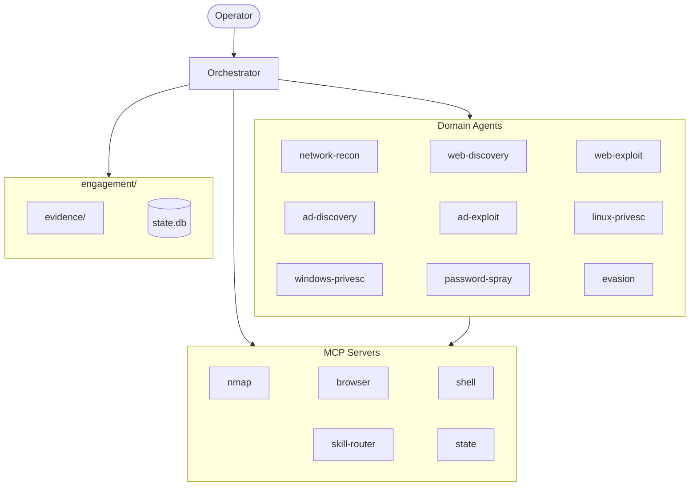

# red-run

Offensive security toolkit for Claude Code.

<p align="center">
  
</p>

red-run turns Claude Code into a penetration testing platform. It combines a library of attack skills, persistent shell sessions, headless browser automation, and engagement state tracking — all orchestrated through an agent architecture that guides Claude through multi-phase attacks.

## What it does

An **orchestrator** skill runs in your main conversation. You give it targets and it presents the attack surface, available paths, and chain analysis. You choose what to hit next. The orchestrator spawns focused agents that each load one skill, execute the methodology end-to-end, save evidence, and report back. State persists in SQLite across context compactions so nothing is lost during long engagements.

**Key capabilities:**

- **Skill-driven methodology** — 67 skills covering web exploitation, Active Directory attacks, privilege escalation, network recon, evasion, and credential cracking. Each skill embeds payloads, tool commands, troubleshooting, and OPSEC guidance.
- **Persistent shell sessions** — Reverse shells and interactive tools (evil-winrm, psexec.py, ssh, msfconsole) maintain state across agent invocations via the shell MCP server.
- **Headless browser automation** — Playwright-backed browser sessions handle CSRF tokens, JavaScript-rendered forms, and multi-step auth flows that curl can't.
- **Semantic skill routing** — ChromaDB + sentence-transformer embeddings match attack scenarios to the right skill via natural language search.
- **Engagement state tracking** — SQLite database tracks targets, credentials, access, vulnerabilities, pivot paths, and blocked techniques. Drives automated chaining.
- **Retrospectives** — Post-engagement analysis identifies skill gaps and routing mistakes for continuous improvement.

## Quick start

```bash
git clone https://github.com/kevinoriley/red-run.git
cd red-run
./install.sh
```

Then start Claude Code from the repo directory and tell it what to attack:

> "Scan and attack 10.10.10.5"

See [Installation](installation.md) for prerequisites and detailed setup.

## How it works



The orchestrator makes every routing decision. When a skill identifies a vulnerability and says "route to X", the orchestrator looks up the correct agent and spawns it with context — injection point, target technology, working payloads. Agents are stateless; all persistent state lives in SQLite.

See [Architecture](architecture.md) for the full design and [Agents](agents.md) for the agent model.

## Documentation

| Page | Contents |
|------|----------|
| [Installation](installation.md) | Prerequisites, setup, sandbox config |
| [Architecture](architecture.md) | Orchestrator, agents, skill lifecycle |
| [MCP Servers](mcp-servers.md) | The 5 MCP servers and their tools |
| [Agents](agents.md) | Domain agent model and routing |
| [Engagement State](engagement-state.md) | SQLite schema, 3-mode architecture, chaining |
| [Writing Skills](writing-skills.md) | Skill format, conventions, templates |
| [Skills Reference](skills-reference.md) | Full skill inventory by category |
| [Running an Engagement](running-an-engagement.md) | Workflow walkthrough |
| [Dashboard](dashboard-and-monitoring.md) | Live monitoring and event polling |

## Disclaimer

> **Authorized use only:** For use in **authorized security testing and educational contexts only**. Do not use against systems without explicit written permission. Skills are baseline templates — expect gaps and techniques that need validation against real targets. While skills include OPSEC notes where relevant, do not trust red-run to maintain OPSEC in production environments without dedicated review and testing.
>
> You are responsible for containing Claude on your systems and for any legal consequences under the CFAA or equivalent legislation.
